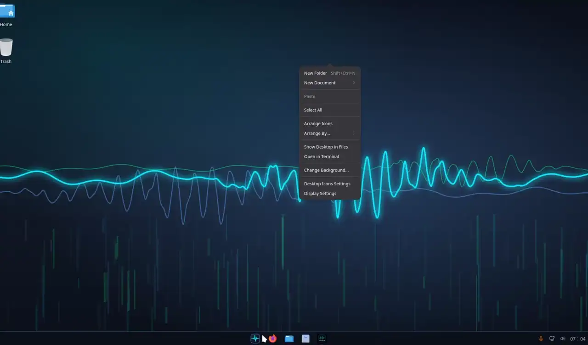

# DecodiumOS

Sistema operativo Linux per radioamatori, derivato da
[AnduinOS 2](https://github.com/AiursoftWeb/AnduinOS-2) (Ubuntu 26.04
"resolute", desktop GNOME in stile Windows). Si avvia da USB in modalità Live,
si installa con l'installer nativo di AnduinOS e al primo avvio ha già
Decodium, i modi digitali, il controllo CAT e gli strumenti SDR pronti.



*DecodiumOS 1.1.1 installato in VirtualBox: il menu Start con le app radio,
Decodium 4 in FT8 sui 14,074 MHz e l'installazione di un logbook dal negozio
software (anteprima a velocità doppia). Video completo:
[decodiumos-demo.mp4](https://github.com/iu8lmc/DecodiumOS/raw/decodiumos/docs/media/decodiumos-demo.mp4)
(1 minuto, 6 MB).*

## Cosa contiene

| Set (`HAM_PACKAGE_SETS`) | Applicazioni |
|---|---|
| — | **Decodium 4** (ultima release GitHub, verificata SHA-256) |
| `rig` | Hamlib (`rigctl`/`rigctld`), flrig, wfview |
| `digital` | WSJT-X, JTDX, JS8Call, Fldigi, flmsg, flamp, QSSTV, FreeDV |
| `logging` | TQSL (LoTW), KLog, Xlog, Tlf, Xdx |
| `packet` | Dire Wolf, AX.25 tools/apps, Pat (Winlink), Xastir |
| `satellite` | Gpredict |
| `sdr` | Gqrx, rtl-sdr, SoapySDR, HackRF, Airspy, CubicSDR, Inspectrum, multimon-ng |
| `cw` | Aldo, qrq, morse, ebook2cw |
| `antenna` | xnec2c, nec2c, yagiuda, SPLAT! |
| `tools` | gpsd, CuteCom, minicom, pavucontrol, qpwgraph |
| `extra` (non predefinito) | CQRLOG, GNU Radio, gr-satellites, SatDump, Quisk, FBB, LinPac, soundmodem |

Integrazione di sistema (pacchetto `decodiumos-base`):

- porte seriali CAT/PTT (`ttyUSB*`, `ttyACM*`) accessibili subito
  all'utente del desktop (tag udev `uaccess`) e gruppo `dialout` aggiunto
  automaticamente a ogni utente locale a ogni avvio;
- ModemManager non sonda più le interfacce radio (le sonde AT possono mandare
  in trasmissione la radio o bloccare la CAT);
- PTT via GPIO dei chip C-Media CM108/CM119 (Digirig, Dire Wolf) accessibile;
- sincronizzazione NTP più frequente (poll massimo 256 s) per FT8/FT4/FT2;
- cartella "Radioamatore" nel menu e Decodium fissato sulla barra;
- identità `ID=decodiumos`, `ID_LIKE="ubuntu debian"`, `UBUNTU_CODENAME`
  conservato (PPA e script di terze parti continuano a funzionare).

Aspetto (pacchetto `decodiumos-branding`), con i colori del tema
"Ocean Blue" di Decodium 4 (fondo `#0A0F1A`, blu `#4A90E2`, segnale
`#00D4FF`, decodifica `#00FF88`):

- logo DecodiumOS, schermata di avvio (Plymouth), schermata di accesso,
  sfondi chiaro e scuro, pulsante del menu Start, colori di barra e menu,
  finestre e pannelli di GNOME in blu notte nel tema scuro (i grigi del tema
  Fluent diventano le superfici di Decodium), menu GRUB della ISO e logo di
  `fastfetch`;
- installer, app di benvenuto, Centro driver e Aspetto si presentano come
  DecodiumOS in tutte le lingue: le traduzioni vengono riscritte insieme ai
  sorgenti, la presentazione dell'installer racconta DecodiumOS (inglese e
  italiano) e la voce di avvio UEFI si chiama `DecodiumOS`.

I file AnduinOS coinvolti vengono deviati con `dpkg-divert` (gli originali
restano accanto come `*.anduinos`) e `/usr/libexec/decodiumos/rebrand`
rigenera le copie DecodiumOS; un hook APT lo riesegue dopo ogni
aggiornamento, così i pacchetti AnduinOS continuano ad aggiornarsi senza
riportare il vecchio marchio. `sudo /usr/libexec/decodiumos/rebrand --undo`
ripristina tutto.

Aggiornare Decodium su un sistema installato:

```bash
decodiumos-update-decodium --check          # confronta installato/disponibile
sudo decodiumos-update-decodium             # installa l'ultima release
sudo decodiumos-update-decodium --version v1.0.627
```

## Compilare la ISO

L'host di build deve essere **Ubuntu 26.04** (il codename deve coincidere con
`TARGET_UBUNTU_VERSION` in `args.sh`), con un utente non root che usa `sudo`,
connessione Internet e molto spazio libero su disco.

```bash
git clone <questo repository> decodiumos
cd decodiumos
make menuconfig     # opzionale: set di applicazioni, release di Decodium...
make
```

La ISO e il suo SHA-256 finiscono in `dist/`
(`DecodiumOS-<versione>-<data>-amd64.iso`). Per ARM64:
`TARGET_ARCH=arm64 make`.

Da Windows si può compilare in WSL2 (`wsl --install -d Ubuntu-26.04`), ma il
repository va clonato nel filesystem Linux (`~/decodiumos`), **non** in
`/mnt/c`: debootstrap e chroot non funzionano su NTFS.

## Come è fatto

La build parte da un Ubuntu minimale, applica in ordine gli script in `mods/`
dentro un chroot e crea la SquashFS Live e la ISO:

| Mod | Origine | Scopo |
|---|---|---|
| `00`–`05` | AnduinOS | base di sistema, desktop, installer |
| `46-casper-patch` | AnduinOS | sessione Live (Casper) |
| `50-decodiumos-base` | DecodiumOS | pacchetto `decodiumos-base` (file in `rootfs/`) |
| `51-hamradio-apps` | DecodiumOS | set di applicazioni da `sets/*.list` |
| `52-decodium` | DecodiumOS | Decodium dall'AppImage ufficiale, come pacchetto `decodium` |
| `53-decodiumos-branding` | DecodiumOS | pacchetto `decodiumos-branding`: grafica e rebrand |
| `80`–`85` | AnduinOS | initramfs Live, locale, rete, pulizia |

Aggiungere un programma: una riga in `mods/51-hamradio-apps/sets/<set>.list`.
I pacchetti che non esistono per la release/architettura, o che si
porterebbero dietro compilatori, `xterm` o snapd, vengono saltati con un
avviso invece di rompere la build.

La grafica nasce da `mods/53-decodiumos-branding/artwork/generate.py`, che
scrive gli SVG (logo, sfondi, spinner, immagini della presentazione) con la
palette di Decodium 4; la build li converte in PNG con `rsvg-convert`. Il
testo del marchio è convertito in tracciati dal font Montserrat (SIL OFL),
quindi il risultato non dipende dai font installati.

## Seguire AnduinOS upstream

DecodiumOS segue le **release** di AnduinOS 2, non il ramo `master`: le
release usano solo pacchetti del repository pubblico `packages.anduinos.com`,
mentre `master` può dipendere da pacchetti presenti solo nel repository di
sviluppo. La base attuale è il tag `2.0.2`.

Il remote `upstream` punta ad AnduinOS 2. Le modifiche DecodiumOS vivono in
mod separati, quindi i conflitti restano confinati a `args.sh`, `build.sh`,
`menuconfig.sh` e questo README. Per passare a una nuova release:

```bash
git fetch upstream --tags
git merge <nuovo-tag>        # es. 2.1.0
```

## Limiti noti

- I nomi tecnici restano quelli di AnduinOS: pacchetti `anduinos-*`,
  repository `packages.anduinos.com`, percorsi come
  `/usr/lib/anduinos-installer-beta`. Rinominarli vorrebbe dire ricompilare
  e ospitare in proprio tutti quei pacchetti, perdendo gli aggiornamenti di
  AnduinOS. I pacchetti di DecodiumOS si chiamano `decodiumos-*`.
- Il tema chiaro resta quello Fluent standard; le app Qt seguono il proprio
  tema (Decodium usa già i suoi colori Ocean Blue).
- La suite di accettazione QEMU (`make test`) verifica ancora il marchio
  AnduinOS (testo della tty, logo) e va adattata; i test unitari girano solo
  su Linux.
- ModemManager ignora tutte le porte `ttyUSB`/`ttyACM`: i vecchi modem
  cellulari seriali non vengono gestiti.
- Un utente creato dopo l'installazione entra in `dialout` al riavvio
  successivo; l'accesso dal desktop funziona subito grazie a `uaccess`.

## Licenza e crediti

GPL-3.0, come AnduinOS (vedi [LICENSE](LICENSE) e [OSS.md](OSS.md)).
Basato sul lavoro del team AnduinOS / Aiursoft. Decodium è di IU8LMC e
contributori ([Decodium 4](https://github.com/iu8lmc/Decodium-4.0-Core-Shannon)).
Le applicazioni radioamatoriali provengono dagli archivi Ubuntu e Debian
Hamradio, ciascuna con la propria licenza. Il marchio DecodiumOS usa il font
[Montserrat](https://github.com/JulietaUla/Montserrat) (SIL Open Font
License 1.1).
